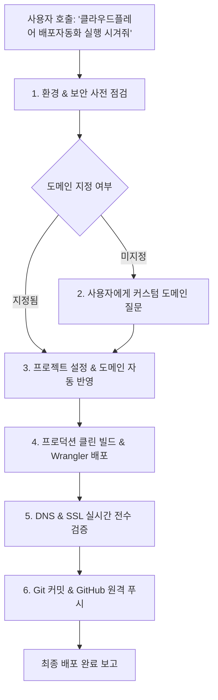

# auto-publish-c — Cloudflare Workers 완전 자동화 배포 가이드

스킬 이름: `auto-publish-c`  
호출 명령어: **`클라우드플레어 배포자동화 실행 시겨줘`** 또는 **`$auto-publish-c`**

이 스킬은 현재 프로젝트 폴더를 **Git/GitHub 형상관리 → Cloudflare Workers 배포 → 커스텀 도메인 질문 및 DNS/SSL 완전 자동 연결 → 배포 후 라이브 전수 검증**까지 사람의 수동 개입 없이 원스톱으로 처리하는 표준 자동화 파이프라인입니다.

---

## 🎯 전체 워크플로우 한눈에 보기



---

## Step 1. 환경 및 보안 사전 점검

1. **보안 규칙 (.gitignore 필수 검사)**:
   - API 키, 토큰, 환경변수가 노출되지 않도록 `.gitignore`에 아래 항목이 반드시 포함되어 있는지 확인하고 없으면 자동 추가합니다:
     ```gitignore
     .env*
     .dev.vars*
     dist/
     .wrangler/
     ```
2. **Cloudflare 로그인 세션 확인**:
   ```bash
   npx wrangler whoami
   ```
   - 정상 로그인 및 계정 ID가 확인되어야 합니다.
3. **Git 저장소 상태 확인**:
   - `.git` 폴더가 없으면 초기화합니다:
     ```bash
     git init
     ```

---

## Step 2. 커스텀 도메인 확인 (대화형 질문)

사용자의 프롬프트에 도메인이 명시되어 있지 않은 경우, 반드시 사용자에게 직접 연결할 도메인을 질문합니다:

> "연결하실 **커스텀 도메인(예: `sub.domain.com` 또는 `domain.com`)**을 알려주세요. DNS 설정과 SSL 발급까지 한 번에 자동 진행합니다."

사용자가 도메인(예: `battery.suriwiki.com`)을 회신하면 즉시 다음 단계로 자동 진행합니다.

---

## Step 3. 프로젝트 설정 & 커스텀 도메인 자동 반영

### A. Wrangler 설정 (`wrangler.json`)
1. 프로젝트 식별 이름(예: 폴더명 또는 `package.json`의 `name`)을 확인합니다.
2. 루트 `wrangler.json`에 `routes`와 `workers_dev` 설정을 구성합니다:
   ```json
   {
     "$schema": "node_modules/wrangler/config-schema.json",
     "name": "<프로젝트-이름>",
     "compatibility_date": "2026-05-15",
     "routes": [
       {
         "pattern": "<custom-domain>",
         "custom_domain": true
       }
     ],
     "workers_dev": true,
     "observability": {
       "enabled": true
     }
   }
   ```
   > ⚠️ **주의 (코드 10021 방지)**: `vite.config.ts`의 `localBindingConfig`에 `compatibility_flags: ['nodejs_compat']`가 이미 지정되어 있다면 루트 `wrangler.json`에는 `compatibility_flags`를 중복으로 넣지 않습니다.

### B. 코드베이스 내 사이트 URL & 검색엔진 동기화
1. **`lib/site-config.ts` (또는 환경설정 파일)**:
   - `origin`: `'https://<custom-domain>'`
   - `isPreview`: `false` (프로덕션 라이브 상태로 전환하여 검색엔진 색인 허용)
2. **`layout.tsx`, `robots.ts`, `sitemap.ts`**:
   - `siteConfig.origin`을 참조하여 `robots.txt`의 사이트맵 주소와 `sitemap.xml`의 모든 `<loc>` 주소가 새 커스텀 도메인으로 자동 매핑되도록 합니다.

---

## Step 4. 프로덕션 클린 빌드 & 배포

1. **클린 컴파일**:
   ```bash
   rm -rf dist && npm run build
   ```
   - RSC, SSR, Client 번들 컴파일 및 정적 자산 생성 오류(0건)를 확인합니다.
2. **Cloudflare Workers 배포**:
   ```bash
   npx wrangler deploy
   ```
   - Cloudflare 시스템이 Worker 자산을 업로드하고, **커스텀 도메인의 DNS 레코드 및 전용 SSL 보안 인증서를 자동으로 프로비저닝**합니다. (수동 CNAME 등록 절대 불필요)

---

## Step 5. DNS & SSL 실시간 전수 검증

배포 직후 DNS 전파 및 사이트 응답을 자동 점검합니다:

```bash
# 1. Cloudflare Anycast DNS 리졸브 확인
dig +short @1.1.1.1 <custom-domain>

# 2. SSL 핸드셰이크 및 HTTP/2 200 OK 직접 검증
/usr/bin/curl -sIL --resolve <custom-domain>:443:<IP주소> https://<custom-domain>

# 3. robots.txt 규약 및 Sitemap URL 검증
/usr/bin/curl -sL --resolve <custom-domain>:443:<IP주소> https://<custom-domain>/robots.txt | tail -n 10
/usr/bin/curl -sL --resolve <custom-domain>:443:<IP주소> https://<custom-domain>/sitemap.xml | head -n 20

# 4. 주요 서브페이지 정상 응답(200 OK) 전수 점검
for path in / /vehicles /regions /reviews /service; do
  /usr/bin/curl -s -o /dev/null -w "%{http_code}" --resolve <custom-domain>:443:<IP주소> "https://<custom-domain>${path}"
done
```

---

## Step 6. Git 커밋 & GitHub 원격 저장소 완전 자동 연동

1. **민감 파일 누출 최종 점검**:
   ```bash
   git status -s
   ```
   - `.env`, `.dev.vars` 등이 unstaged 상태에 없는지 철저히 점검합니다.
2. **Git 로컬 커밋**:
   ```bash
   git add -A
   git commit -m "feat: Deploy to Cloudflare Workers with custom domain <custom-domain>"
   ```
3. **GitHub 원격 저장소 완전 자동 연동 (GitHub CLI 활용)**:
   - `git remote -v`에 `origin`이 등록되어 있는 경우:
     ```bash
     git push origin main
     ```
   - 원격 저장소가 아직 연결되지 않은 새 프로젝트인 경우:
     - 시스템의 GitHub CLI(`gh auth status`)를 통해 웹사이트에 접속할 필요 없이 **GitHub 리포지토리 자동 생성, `origin` 연결, 최초 push까지 완전 자동 수행**합니다:
       ```bash
       gh repo create <프로젝트명> --public --source=. --remote=origin --push
       ```
       *(비공개 저장을 원할 경우 `--private` 옵션 적용)*

---

## 🛠️ 실전 트러블슈팅 가이드

| 오류 코드 / 현상 | 원인 | 자동 해결책 |
|---|---|---|
| **`code: 100117`** | Cloudflare DNS에 사용자가 수동으로 등록한 CNAME/A 레코드가 이미 존재함 | Cloudflare 대시보드 DNS Records에서 해당 서브도메인의 수동 CNAME을 삭제한 뒤 `npx wrangler deploy`를 재실행합니다. |
| **`code: 10021`** | `compatibility_flags` (`nodejs_compat` 등)가 중복 선언됨 | `vite.config.ts`와 `wrangler.json` 중 한 곳의 중복 플래그를 제거하고 빌드합니다. |
| **`SSL handshake failure` / `code 6`** | 도메인 DNS 로컬 캐시 전파 지연 | Cloudflare 네임서버 및 1.1.1.1에는 즉시 등록되므로, 검증 시 `--resolve <domain>:443:<Cloudflare_IP>` 플래그로 즉시 SSL 검증을 마칩니다. |
| **`robots.txt`에 구 도메인이 표시됨** | Cloudflare Edge 캐시(TTL) 잔여 | 빌드 번들 내 `dist`를 삭제하고 재빌드하여 새 버전 배포를 실행하면 즉시 새 도메인으로 교체됩니다. |
