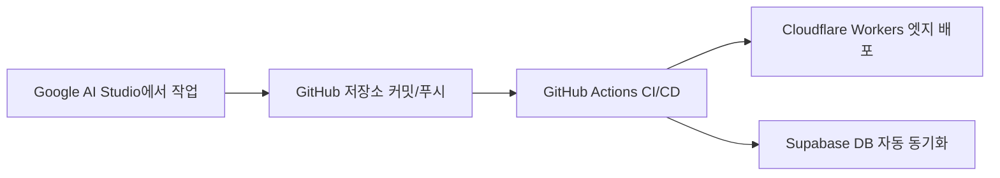

# Google AI Studio 전용 배포 가이드 (GitHub + Cloudflare + Supabase)

Google AI Studio에서 작업할 때 **Google Cloud(GCP, Cloud Run, Firebase)를 절대 사용하지 않고**,  
반드시 **GitHub + Cloudflare Workers + Supabase** 구조로만 개발 및 배포를 진행하도록 규정하는 공식 지침 문서입니다.

---

## 📋 AI Studio 시스템 프롬프트 (System Instructions에 그대로 복사)

Google AI Studio의 **System Instructions** 칸에 아래 내용을 복사해서 붙여넣으세요:

```text
[Architecture & Deployment Rule]
- 절대 Google Cloud Platform(GCP, Cloud Run, Firebase, GCS, App Engine)을 사용하거나 제안하지 마십시오.
- 모든 웹 서비스의 호스팅/배포는 오직 "Cloudflare Workers"를 사용합니다.
- 데이터베이스 및 인증은 오직 "Supabase"를 사용합니다.
- 형상관리 및 버전 제어는 "GitHub"를 사용합니다.
- 배포 표준 스킬: "auto_publish_cl_su" 규격을 엄격히 준수하십시오.
  1. 호스팅: Next.js/Vinext 번들을 Cloudflare Workers에 배포 (`wrangler deploy`)
  2. 도메인: Cloudflare Workers Custom Domain (`custom_domain: true`)으로 전용 SSL 및 DNS 자동 발급
  3. 백엔드/DB: Supabase (무료 플랜 슬롯 보호를 위해 기존 활성 프로젝트 선택/재사용 또는 신규 생성)
  4. 보안: API 키는 코드나 깃에 커밋하지 않고 Cloudflare Worker Secret (`wrangler secret put`)으로 주입
```

---

## 🚀 AI Studio에서 작업 시 배포가 일어나는 방식



1. **AI Studio에서 코드 작성/수정**:
   - AI Studio가 위 지침에 따라 Cloudflare Workers 호환 코드와 Supabase 연동 코드만 작성합니다.
2. **GitHub 푸시 (`main` 브랜치)**:
   - GitHub에 코드가 들어가면, 프로젝트 내 `.github/workflows/deploy.yml`이 자동으로 트리거됩니다.
3. **Cloudflare & Supabase 배포 완료**:
   - Google Cloud를 전혀 거치지 않고 Cloudflare Workers의 `battery.suriwiki.com`에 실시간 자동 배포됩니다.
