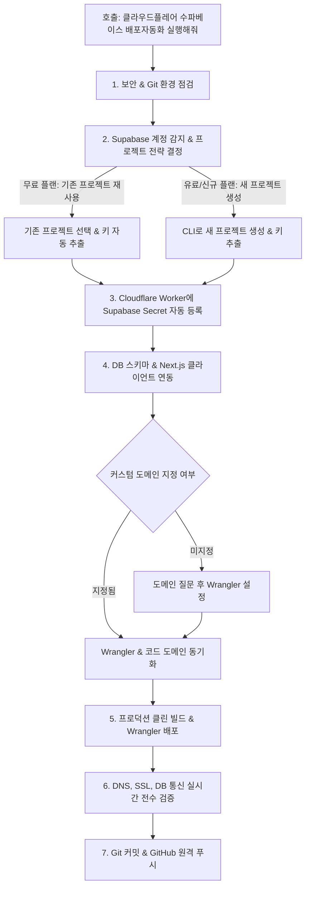

# auto_publish_cl_su — Cloudflare Workers + Supabase 완전 자동화 배포 가이드

스킬 이름: `auto_publish_cl_su`  
호출 명령어:
- **`클라우드플레어 수파베이스 배포자동화 실행해줘`**
- **`클라우드플레어 배포자동화 실행 시겨줘`**
- **`$auto_publish_cl_su`**

이 스킬은 웹 콘솔(Cloudflare, Supabase)에 직접 들어가지 않고, 터미널 세션과 코딩만으로 **Git/GitHub 형상관리 → Supabase 프로젝트 선택/생성 및 키 주입 → Cloudflare Workers 배포 → 커스텀 도메인 질문 및 DNS/SSL 자동 바인딩 → 배포 후 라이브 전수 검증**까지 원스톱으로 처리하는 표준 자동화 파이프라인입니다.

> ⚠️ **핵심 아키텍처 철칙 (Google AI Studio 포함 필수 규칙)**:
> - **Google Cloud(GCP, Cloud Run, Firebase, GCS 등)는 절대 사용하거나 제안하지 않습니다.**
> - 모든 인프라는 오직 **GitHub(형상관리) + Cloudflare Workers(글로벌 엣지 호스팅 및 커스텀 도메인) + Supabase(PostgreSQL DB 및 인증)** 3대 조합으로만 구축 및 배포합니다.
> - Google AI Studio 등 클라우드 AI 환경에서 실행될 때도 이 원칙은 동일하게 강제됩니다.

---

## 🎯 전체 워크플로우 한눈에 보기



---

## Step 1. 환경 및 보안 사전 점검

1. **보안 격리 (.gitignore 검사)**:
   - Supabase 키, Cloudflare 토큰, 환경변수가 커밋에 포함되지 않도록 `.gitignore`에 아래 항목을 반드시 보장합니다:
     ```gitignore
     .env*
     .dev.vars*
     dist/
     .wrangler/
     ```
2. **Cloudflare & Supabase CLI 세션 확인**:
   ```bash
   npx wrangler whoami
   npx supabase projects list --output json
   ```
   - Cloudflare 계정 및 Supabase 계정 연결 상태를 확인합니다.
3. **Git 저장소 상태 확인**:
   - `.git` 폴더가 없으면 `git init`을 자동 수행합니다.

---

## Step 2. Supabase 프로젝트 전략 (무료 재사용 vs 유료 생성)

Supabase CLI로 현재 활성 프로젝트 목록을 조회합니다:
```bash
npx supabase projects list --output json
```

### A. 무료 플랜 (기존 프로젝트 공유/재사용 전략 - 추천)
- 무료 플랜(프로젝트 2개 제한)을 유지하기 위해 **기존 활성 프로젝트(예: `suriwiki`, `jeakyung-dotcom` 등)를 선택**합니다.
- 선택한 프로젝트의 `Project Ref`로 키를 조회합니다:
  ```bash
  npx supabase projects api-keys --project-ref <PROJECT_REF> --reveal --output json
  ```
- 추출된 정보:
  - `SUPABASE_URL`: `https://<PROJECT_REF>.supabase.co`
  - `SUPABASE_ANON_KEY`: `anon` 공개 키
  - `SUPABASE_SERVICE_ROLE_KEY`: `service_role` 비밀 키
- 프로젝트 내에 서비스 전용 네임스페이스 테이블(예: `battery_inquiries`, `battery_keywords` 등)을 생성하여 비용 0원으로 독립 운영합니다.

### B. 유료 플랜 또는 신규 프로젝트 생성 전략
- 사용자가 새 프로젝트 생성을 요청하거나 슬롯 여유가 있는 경우, CLI로 즉시 생성합니다:
  ```bash
  npx supabase projects create <프로젝트명> --org-id <ORG_ID> --db-password <DB비밀번호> --region ap-northeast-2
  ```
- 생성이 완료되면 동일하게 `api-keys` 명령어로 키를 자동 추출합니다.

---

## Step 3. Cloudflare Worker에 Secret 암호화 자동 주입

Cloudflare Workers 런타임에서 안전하게 Supabase에 접근할 수 있도록 Secret을 자동 등록합니다:

```bash
# 로컬 개발용 (.dev.vars 생성)
echo "NEXT_PUBLIC_SUPABASE_URL=https://<PROJECT_REF>.supabase.co" > .dev.vars
echo "NEXT_PUBLIC_SUPABASE_ANON_KEY=<ANON_KEY>" >> .dev.vars
echo "SUPABASE_SERVICE_ROLE_KEY=<SERVICE_ROLE_KEY>" >> .dev.vars

# Cloudflare Workers 런타임 암호화 Secret 등록
echo "https://<PROJECT_REF>.supabase.co" | npx wrangler secret put NEXT_PUBLIC_SUPABASE_URL
echo "<ANON_KEY>" | npx wrangler secret put NEXT_PUBLIC_SUPABASE_ANON_KEY
echo "<SERVICE_ROLE_KEY>" | npx wrangler secret put SUPABASE_SERVICE_ROLE_KEY
```

---

## Step 4. DB 테이블 스키마 생성 & 코드 연동

1. **테이블 생성 (SQL DDL)**:
   - 필요한 테이블(예: 실시간 문의 접수 테이블)을 원격 DB에 생성합니다.
     ```sql
     create table if not exists public.battery_inquiries (
       id bigint generated by default as identity primary key,
       vehicle text not null,
       year text not null,
       region text,
       symptoms text[],
       photos text[],
       status text default 'pending',
       created_at timestamp with time zone default timezone('utc'::text, now()) not null
     );
     ```
2. **Supabase 클라이언트 라이브러리 설치 및 헬퍼 파일 구성**:
   - `npm install @supabase/supabase-js`
   - `lib/supabase.ts` 구성:
     ```typescript
     import { createClient } from '@supabase/supabase-js';

     const supabaseUrl = process.env.NEXT_PUBLIC_SUPABASE_URL!;
     const supabaseAnonKey = process.env.NEXT_PUBLIC_SUPABASE_ANON_KEY!;

     export const supabase = createClient(supabaseUrl, supabaseAnonKey);
     ```

---

## Step 5. 커스텀 도메인 질문 & Wrangler 설정

1. **도메인 질문**:
   - 사용자 프롬프트에 도메인이 없으면:  
     *"연결하실 **커스텀 도메인(예: `sub.domain.com` 또는 `domain.com`)**을 알려주세요. DNS 설정과 SSL 발급까지 한 번에 자동 진행합니다."* 질문.
2. **Wrangler 및 사이트 설정 동기화**:
   - `wrangler.json`에 `routes: [{ "pattern": "<custom-domain>", "custom_domain": true }]` 추가
   - `lib/site-config.ts`의 `origin`을 `https://<custom-domain>`으로 갱신하고 `isPreview: false`로 설정.

---

## Step 6. 프로덕션 클린 빌드 & 배포

```bash
# 1. 클린 빌드
rm -rf dist && npm run build

# 2. Cloudflare Worker 배포
npx wrangler deploy
```
- Cloudflare가 **DNS 레코드 매핑 및 전용 SSL 보안 인증서를 시스템 레벨에서 자동 생성/발급**합니다.

---

## Step 7. 전수 검증 (DNS, SSL, DB)

```bash
# 1. Cloudflare Anycast DNS 리졸브 확인
dig +short @1.1.1.1 <custom-domain>

# 2. HTTPS/SSL 핸드셰이크 직접 검증 (HTTP/2 200 OK)
/usr/bin/curl -sIL --resolve <custom-domain>:443:<IP주소> https://<custom-domain>

# 3. robots.txt 및 sitemap.xml 검증
/usr/bin/curl -sL --resolve <custom-domain>:443:<IP주소> https://<custom-domain>/robots.txt
/usr/bin/curl -sL --resolve <custom-domain>:443:<IP주소> https://<custom-domain>/sitemap.xml
```

---

## Step 8. Git 커밋 & GitHub 원격 저장소 완전 자동 연동

1. **민감 파일 누출 최종 점검**:
   ```bash
   git status -s
   ```
   - `.env`, `.dev.vars` 등이 unstaged 상태에 없는지 철저히 점검합니다.

2. **Git 로컬 커밋**:
   ```bash
   git add -A
   git commit -m "feat: Deploy to Cloudflare Workers with Supabase integration & custom domain <domain>"
   ```

3. **GitHub 원격 저장소 완전 자동 연동 (GitHub CLI 활용)**:
   - 현재 프로젝트에 `git remote -v`가 등록되어 있는지 점검합니다:
     ```bash
     git remote -v
     ```
   - **Case A: GitHub 원격 저장소가 이미 연결된 경우**:
     ```bash
     git push origin main
     ```
   - **Case B: GitHub 원격 저장소가 아직 없는 새 프로젝트인 경우**:
     - 시스템에 로그인된 GitHub CLI(`gh auth status`)를 활용하여 웹사이트에 들어갈 필요 없이 **GitHub 원격 저장소 자동 생성, `origin` 연결, 최초 push까지 완전 자동 수행**합니다:
       ```bash
       gh repo create <프로젝트명> --public --source=. --remote=origin --push
       ```
       *(비공개 저장을 원할 경우 `--private` 옵션 적용)*

---

## 🛠️ 실전 트러블슈팅

| 상황 | 원인 | 해결책 |
|---|---|---|
| **Supabase 프로젝트 한도 초과** | 무료 플랜 2개 슬롯 소진 | 새 프로젝트 대신 기존 활성 프로젝트(`suriwiki` 등)를 선택하여 전용 접두사 테이블(`battery_*`)로 생성/공유합니다. |
| **Mac 키체인 암호 요청 팝업** | Supabase CLI의 토큰 보안 접근 | Mac 로그인 비밀번호를 입력하고 `[항상 허용]`을 누르면 이후 백그라운드 자동화가 중단 없이 유지됩니다. |
| **`code: 100117`** | Cloudflare DNS에 수동 CNAME 존재 | Cloudflare DNS Records에서 해당 서브도메인의 수동 CNAME을 삭제 후 `npx wrangler deploy`를 재실행합니다. |
| **`code: 10021`** | 중복 compatibility flag | 루트 `wrangler.json`에서 중복 플래그를 제거합니다. |
